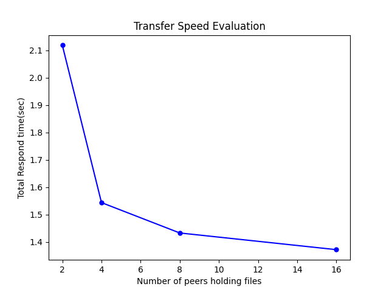

# Evaluation Report

According to the result graph, we can see that the transfer speed is getting higher when we add more nodes to serve the target file. Although due to the limitation of threading in Python, the increment isn't very obvious, but we can still see a little bit improvement on the performance.
